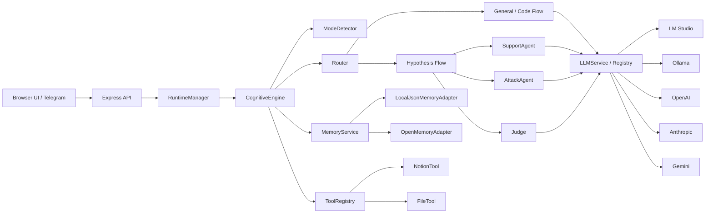

# Local Cognitive AI System

Local multi-model AI workspace with:

- browser dashboard on `localhost`
- Telegram access
- local LLMs via LM Studio or Ollama
- cloud LLMs via OpenAI, Anthropic, Gemini
- debate mode with support / attack / judge roles
- plugins for Notion and filesystem actions
- local long memory

The goal is simple: one personal system you can use every day for research, coding, note-taking, and orchestration.

## What You Get

- `Chat Workspace` for normal chat, hypothesis debates, and code mode
- `Models` page for LM Studio loaded models, provider status, and runtime checks
- `Plugins` page for Notion and filesystem setup
- `Settings` page for provider keys, Telegram, and memory
- session-based configuration, history, and message persistence

## Screenshots

### Chat Workspace


### Models


### Plugins


### Cloud Provider Settings


## Quick Start

### 1. Requirements

- Node.js `>= 18.18.0`
- npm
- one of:
  - LM Studio
  - Ollama

### 2. Install

```bash
npm install
cp .env.example .env
```

### 3. Start

```bash
npm run dev
```

Open:

```text
http://127.0.0.1:3000
```

## Fastest Local Setup

If you want the system working as fast as possible, use LM Studio.

### 1. Load a few local models in LM Studio

Example roles:

- `support`: `qwen/qwen3.5-9b`
- `attack`: `zai-org/glm-4.6v-flash`
- `judge`: `nvidia/nemotron-3-nano-4b`

### 2. Start the LM Studio server

Typical endpoint:

```text
http://127.0.0.1:1234/v1
```

### 3. Configure `.env`

```env
HOST=127.0.0.1
PORT=3000
HTTP_ENABLED=true

DEFAULT_PROVIDER=lmstudio

LMSTUDIO_BASE_URL=http://127.0.0.1:1234/v1
LMSTUDIO_MODEL=qwen/qwen3.5-9b
LMSTUDIO_API_KEY=lm-studio
LMSTUDIO_TIMEOUT_MS=60000
```

### 4. Run the app

```bash
npm run dev
```

### 5. In the UI

Go to:

- `Models` to confirm loaded models
- `Chat Workspace` to set:
  - mode
  - debate on/off
  - support / attack / judge providers and models

## Cloud Providers

You can mix local and cloud models in one session.

Example:

- `Support`: LM Studio
- `Attack`: OpenAI
- `Judge`: Anthropic

### OpenAI

Use:

```text
Base URL: https://api.openai.com/v1
```

Recommended starting models:

- `gpt-5-mini`
- `gpt-4.1-mini`

### Anthropic

Use:

```text
Base URL: https://api.anthropic.com
```

Recommended starting models:

- `claude-sonnet-4-5`
- `claude-opus-4-1`

### Gemini

Use:

```text
Base URL: https://generativelanguage.googleapis.com
```

After adding keys, use `Test provider` in `Settings`.

## Telegram Setup

Telegram is optional.

### 1. Create a bot

Use `@BotFather` and get a bot token.

### 2. Configure `.env`

```env
TELEGRAM_ENABLED=true
TELEGRAM_BOT_TOKEN=your_bot_token
TELEGRAM_POLL_TIMEOUT_SEC=25
```

### 3. Start the server

```bash
npm run dev
```

If the bot had a webhook before, clear it:

```bash
curl "https://api.telegram.org/bot<YOUR_TOKEN>/deleteWebhook?drop_pending_updates=true"
```

### 4. Chat with the bot

Useful commands:

- `/help`
- `/providers`
- `/models`
- `/settings`
- `/mode hypothesis`
- `/debate on`

## Notion Setup

The Notion plugin can create notes from chat output.

### 1. Create an internal integration in Notion

Grant it at least:

- read content
- insert content
- update content

### 2. Share the target page or database with the integration

If the integration cannot see the page, Notion returns `404 object_not_found`.

### 3. Configure in `Plugins -> Notion`

Add:

- `API key`
- either `Parent page URL`
- or `Data source URL`

Use:

- `Parent page URL` for ordinary notes under a page
- `Data source URL` only if you want to write into a Notion database / data source

### 4. Test

Click `Test`.

Then in chat you can say:

```text
сохрани это в ноушен
```

## Filesystem Plugin

The filesystem plugin is the local execution layer for file operations.

It supports:

- read file
- write file
- append file
- create directory
- list directory
- delete path
- scaffold simple projects

Configure it in `Plugins -> File`.

Important fields:

- `Output directory`
- `Access mode`
  - `restricted`
  - `full`
- `Allowed directories`

If `restricted` is enabled, file operations are allowed only inside listed directories.

## Daily Usage Patterns

### 1. Normal chat

Use `general` mode when you just want one model to answer.

Example:

```text
объясни кратко как работает этот модуль
```

### 2. Debate mode

Use `hypothesis` mode when you want support / attack / judge behavior.

Example:

```text
проверь гипотезу что теория игр подходит как основной слой анализа новостей для telegram-паблика
```

### 3. Code mode

Use `code` mode when you want implementation output.

Example:

```text
создай простой express typescript api проект в `demo-api`
```

```text
создай файл `demo-api/src/index.ts` и добавь healthcheck route
```

### 4. Save result to Notion

Example:

```text
сохрани это в ноушен
```

### 5. Write files locally

Example:

```text
создай файл `notes/summary.md` и запиши туда краткий вывод
```

## Architecture



## Runtime Flow

1. User sends a message from the browser or Telegram.
2. The engine loads session settings and relevant memory.
3. `ModeDetector` chooses `general`, `hypothesis`, or `code`.
4. The router runs the matching execution flow.
5. The selected provider(s) generate output.
6. Tools are called if the prompt implies a tool action.
7. Results are formatted, saved in memory, and shown in the UI.

## Code Mode Behavior

`code` mode supports multiple agents.

Current behavior:

- the first code agent acts as the final writer
- other agents act as advisors
- the system reduces bad merged output by avoiding raw multi-agent file concatenation

This is intentionally safer than letting 5 agents write directly into the same scaffold output.

## Project Structure

```text
src/
  agents/
  api/
  app/
  config/
  core/
  judge/
  llm/
  memory/
  plugins/
  session/
  tools/
  transports/
  types/
  utils/
plugins/
  file/
  notion/
public/
screenshots/
data/
```

## Main API Routes

```text
GET    /health
GET    /meta
GET    /dashboard/bootstrap
GET    /models
GET    /lmstudio/models/loaded
GET    /lmstudio/models/all
POST   /lmstudio/models/load
POST   /lmstudio/models/unload

GET    /sessions
POST   /sessions
PATCH  /sessions/:sessionId
DELETE /sessions/:sessionId
GET    /sessions/:sessionId/messages
GET    /sessions/:sessionId/settings
PUT    /sessions/:sessionId/settings

GET    /app/settings
PUT    /app/settings
POST   /providers/:providerId/test
GET    /plugins/status
POST   /plugins/:pluginName/test
POST   /runtime/reload

POST   /chat
POST   /process
```

## Useful Commands

```bash
npm run dev
npm run build
npm run test
```

## Current Notes

- `VS Code` plugin is still a placeholder bridge configuration, not a full editor transport.
- `OpenMemory` is present as an adapter shape, but the default long memory path is local JSON.
- Cloud provider rate limits can appear in `Models -> Runtime Providers` after `Test provider`.

## Recommended First Run

If you want a stable first experience:

1. Start with LM Studio only.
2. Configure one or two local models.
3. Test `Chat Workspace`.
4. Then add `Notion`.
5. Then add `OpenAI` or `Anthropic` as support / attack / judge roles.

That sequence gives the fastest path to a working daily-driver setup.
