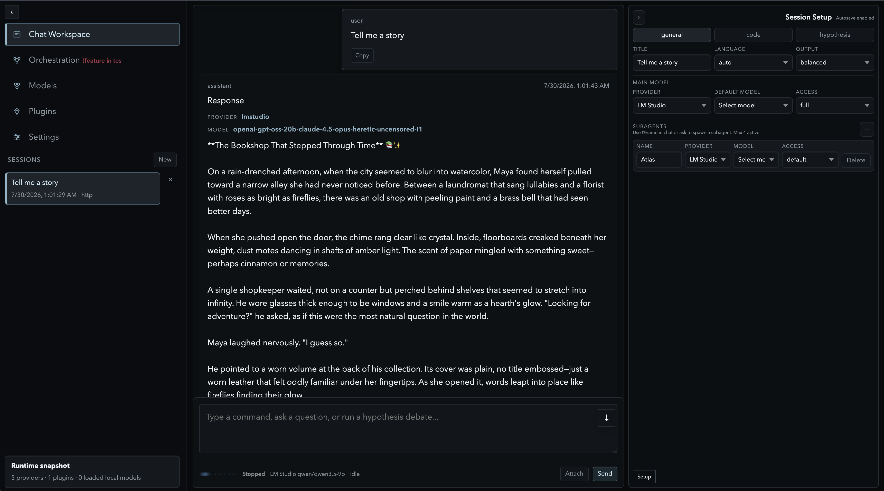
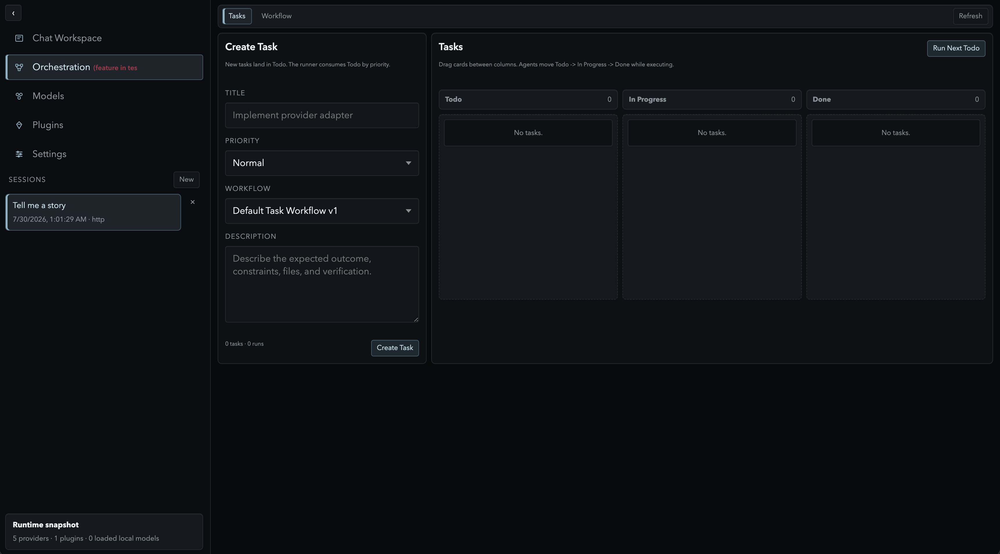
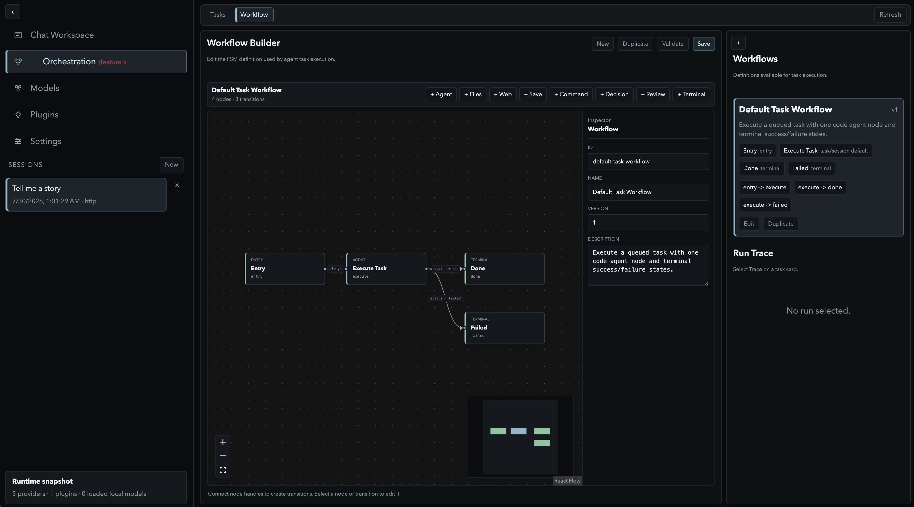
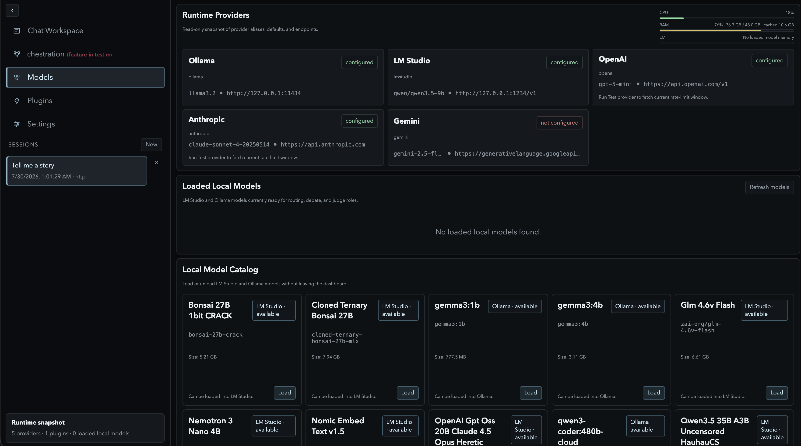
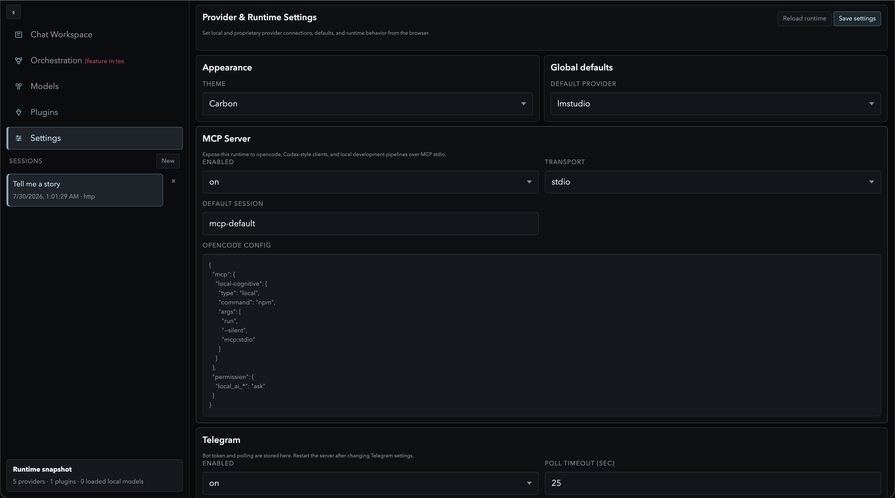
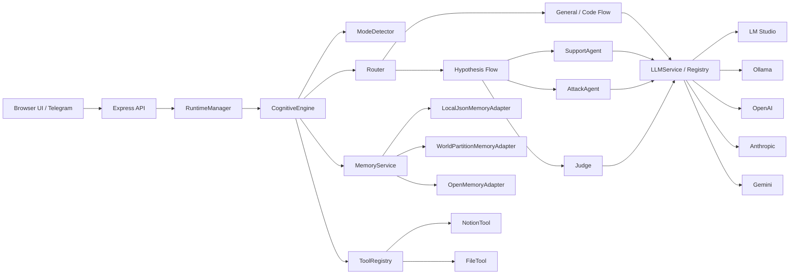

# Local Cognitive AI System

Local multi-model AI workspace with:

- browser dashboard on `localhost`
- Telegram access
- built-in local GGUF inference with llama.cpp; optional LM Studio and Ollama during the transition
- cloud LLMs via OpenAI, Anthropic, Gemini
- debate mode with support / attack / judge roles
- plugins for Notion and filesystem actions
- local long memory

The goal is simple: one personal system you can use every day for research, coding, note-taking, and orchestration.

## What You Get

- `Chat Workspace` for normal chat, hypothesis debates, and code mode
- `Models` panel with a Hugging Face download catalog, installed library, memory controls, and device compatibility warnings
- `Plugins` page for Notion and filesystem setup
- `Settings` page for provider keys, MCP, Telegram, and memory
- session-based configuration, history, and message persistence

## Synthesis DSL

Author module contracts in `.lcspec` and executable agent loops in `.lcflow`, then run them from the **Synthesis** workspace. See the [LC Spec and LC Flow language guide](docs/lc-language.md) for syntax, model selection, runtime functions, complete examples, and current V1 limitations.

## Screenshots

### Chat Workspace



Run everyday chats, switch modes, configure subagents, and keep each conversation in its own session.

### Chat access and approvals

Use the access icon beside **Ready / Local models** in the composer. Each chat saves its own mode, which also governs its agents:

- **Ask for approval** (`ask`): confirm file changes, commands, plugin actions, and access outside the configured workspace. Workspace reads do not require confirmation.
- **Approve for me** (`default`): allow workspace reads and edits; ask before deletions, external access, commands, and plugin actions. Command approval is conservative; there is no automatic command risk classifier.
- **Full access** (`full`): execute requested actions without confirmation, including outside the configured workspace, subject to the OS account's permissions.

The approval card shows the proposed paths and contents or command arguments. **Approve** executes that saved proposal once; **Cancel** skips it. Stopping generation or closing the connection cancels pending approvals. Changing access affects subsequent requests. Permission cannot be granted by text in a prompt or attachment.

For example, ask the model to ``Write file `hello.txt` containing hello`` or `Ping example.com once`. Command proposals run with separate executable/argument fields and a 30-second timeout. Malformed proposals do not execute. This is an application approval policy, not an OS sandbox; approved commands run with the application's OS permissions. Workflow node reviews remain separate. Headless callers without an approval handler receive a permission-required result for actions that need confirmation.

### Local voice input (desktop)

Click the microphone beside **Send**, speak, then press the checkmark to finish.
Whisper transcribes locally and appends the result to the current draft.
Review the text and press **Send** separately. **Esc** or the cross cancels only
the current dictation. The existing draft is preserved. Recordings are limited
to five minutes; switching chats stops recording and saves the result to the
original chat's draft. Recording and transcription survive ordinary UI updates.

The small arrow beside the microphone opens voice settings: choose **Higher
accuracy** (Whisper Large v3 Turbo, 1.5 GiB, five decoding candidates) or **Faster**
(Whisper Small, 465 MiB). Each multilingual model can be downloaded or removed
independently. New installations default to higher accuracy; existing Small
installations keep working until you select and download the larger model.
Choose Auto/Russian/Ukrainian/English (an explicit language is useful for short
dictation with mixed-language technical names), or click
**Choose microphone…** to grant access and list input devices. The model is
downloaded once and verified by SHA-256. Audio stays on the device and temporary
recordings are deleted after recognition/cancellation. On a recognition error,
Retry keeps the current audio in memory until retry or cancellation. Sent text
uses the selected chat provider. Agent access modes do not grant microphone access.

macOS asks for microphone access on first use. If denied, use **Microphone
permissions** in voice settings and restart after changing the system permission.
The embedded speech engine runs separately from the chat model. The first
recognition may take longer while the GPU prepares its kernels.

For development, install CMake and a C++ compiler, then run `npm run prepare:speech`
before `npm run electron`. macOS builds target 13.3 or later and use Metal;
Windows builds must prepare speech on Windows. Packaged builds include the runtime
but download speech model weights on demand. Verify an assembled package with
`node scripts/verify-speech-runtime.mjs "release/mac-arm64/Local Cognitive AI System.app"`.
Voice input currently requires the desktop preload bridge; browser-only mode
continues to support text input.

### Orchestration Tasks



Create prioritized tasks and monitor their progress through the selected workflow.

### Daily and Weekly Schedules

In `Orchestration -> Tasks`, create a daily or weekly schedule with a task
description, workflow, local time, IANA timezone (for example `Europe/Kyiv`),
and—when weekly—the day of the week. The local server checks schedules every
30 seconds and creates a new task for each occurrence, so every run keeps its
own workflow trace and history. If the app was offline at the scheduled time,
it performs one catch-up run after startup and then returns to the normal
cadence.

Schedules run only while the local server/Electron app is running. You can
pause, resume, or delete them from the task board; their definitions persist in
`data/app/schedules/schedules.json` by default.

### Workflow Builder



Design and validate task workflows visually, including success and failure transitions.

### Models and Providers



See cloud provider status, loaded local models, and the local model catalog in one place.

### Runtime Settings



Configure providers, MCP, Telegram, memory, and other local runtime defaults from the dashboard.

## Quick Start

### 1. Requirements

- Node.js `>= 18.18.0`
- npm
- No external model application is required for the built-in provider.

### 2. Install

```bash
npm install
cp .env.example .env
npm run prepare:llama
```

### 3. Start

```bash
npm run dev
```

Open:

```text
http://127.0.0.1:3000
```

Open **Models → Catalog**, choose a quantization, and download it. **On device**
shows verified local files. **Load model** loads weights into memory; **Unload**
releases memory while keeping the download. **Use in chat** selects the model
for the current conversation, and **Set default** changes the application default.
Installed models are available to code/debate agents and workflow nodes even
when unloaded; the first request loads them automatically. Local requests share
one queue, while cloud providers can run alongside them.
Finishing a response, cancelling it, or reaching an agent deadline keeps the
current model loaded. After cancellation, the queue waits for llama.cpp to
confirm its decoding slot is idle. An unresponsive or invalid slot is unloaded
with an explicit recovery error. Manual unload, switching models, runtime
reconfiguration, and application shutdown can still release the model.

The **Context size** control on Models saves the local runtime setting. **Active
context** shows the size confirmed by the loaded llama.cpp process. Local model
selectors mark **Loaded** models and list them first. **Model storage** separates
this app's files, partial downloads, external LM Studio libraries (including
MLX weights that use a different runtime), and recognized temporary test model
libraries; inspecting storage does not delete files.

Downloads support pause, resume, cancellation, SHA-256 verification, and complete
multi-file GGUF variants. Public text models are supported; gated repositories,
MLX, and safetensors are not direct imports. Device memory estimates include
weights, context/KV cache, recurrent state and working space. The configured
memory percentage is a warning threshold, not a loading cap. Models above it
can still load; only weights exceeding all device memory are blocked. macOS
estimates account for reclaimable file cache. The native loader validates model
architecture support, including Qwen3.5/3.8; projector and encoder-only files
cannot be used as standalone chat models. Estimates do not guarantee fit or
generation quality.

The desktop build bundles pinned llama.cpp **b10809 / 0.4.0** with native libraries
and license notices. Build scripts verify the archive hash; user launches never
compile or download the runtime. Models live in the app's user-data directory,
outside the installation, and remain available offline. Settings support another
storage directory; files are copied and verified before switching, and the
previous files remain as a backup. Existing LM Studio/Ollama targets are preserved; migration
does not rewrite conversation history or completed workflow snapshots.

Run ordinary regression tests with `npm test`. Real inference is an explicit
opt-in and downloads the four pinned recommended variants (about 1.8 GB):

```bash
LLAMA_CPP_INTEGRATION=1 LLAMA_TEST_DATA_DIR=/tmp/llama-acceptance npm run test:llama
node scripts/verify-packaged-runtime.mjs "release/mac-arm64/Local Cognitive AI System.app"
```

The real test covers downloads, load/unload, final answers, JSON parsing, queued
models, chat, workflow review/completion, and an offline restart. Without the
opt-in it is reported as skipped, not as a successful inference test. Platform
archives for macOS Intel and Windows CPU are pinned; acceptance on those machines
must be performed separately before claiming support there.

## Desktop Builds

The desktop package uses Electron as a thin shell around the existing local
Express server and browser dashboard. The backend, plugins, and UI are reused;
the app stores runtime data in the operating system user-data directory.

Build macOS DMGs for Apple Silicon and Intel:

```bash
npm run dist:mac
```

Build only one architecture:

```bash
npm run dist:mac:arm64
npm run dist:mac:x64
```

Build a Windows x64 NSIS installer:

```bash
npm run dist:win
```

Artifacts are written to `release/`.

Notes:

- The built-in provider runs without LM Studio or Ollama. Those optional
  integrations still require their own application and endpoint when selected.
- Desktop settings are stored in Electron's user data directory, independently
  of the repository's `.env` and `data/app/settings.json`. Saved provider
  settings take precedence over defaults. If an existing installation still
  aborts generation after 20 seconds, set the local provider timeout to at least
  `300000` ms in Settings; a reasoning model may need minutes for its final answer.
- Built-in loading has its own timeout (five minutes by default). Generation
  has a separate ten-minute default. A single local queue serializes model
  switches and generation across chats, agents, and workflows.
- Release builds are unsigned until Apple Developer ID / Windows code-signing
  certificates are configured.
- macOS builds use Electron's default icon until a project `.icns` asset is
  configured in the `build.mac.icon` field.

## Fastest Local Setup

If you want the system working as fast as possible, use LM Studio.

### 1. Load local models in LM Studio first

The engine does not download or load your local models by itself.

The correct order is:

1. load the models in LM Studio
2. start the LM Studio local server
3. open this dashboard
4. assign those already loaded models inside `Chat Workspace` or `Settings`

Example roles:

- `support`: `qwen/qwen3.5-9b`
- `attack`: `zai-org/glm-4.6v-flash`
- `judge`: `nvidia/nemotron-3-nano-4b`

### 2. Start the LM Studio server

Typical endpoint:

```text
http://127.0.0.1:1234/v1
```

### 3. Configure `.env`

```env
HOST=127.0.0.1
PORT=3000
HTTP_ENABLED=true

DEFAULT_PROVIDER=lmstudio

LMSTUDIO_BASE_URL=http://127.0.0.1:1234/v1
LMSTUDIO_MODEL=qwen/qwen3.5-9b
LMSTUDIO_API_KEY=lm-studio
LMSTUDIO_TIMEOUT_MS=300000
```

### 4. Run the app

```bash
npm run dev
```

### 5. In the UI

Go to:

- `Models` to confirm loaded models
- `Chat Workspace` to set:
  - mode
  - debate on/off
  - support / attack / judge providers and models

That means a normal working flow looks like this:

1. load models in LM Studio
2. confirm them in `Models -> Loaded Local Models`
3. go to `Chat Workspace`
4. assign roles in `Session Setup`
5. start chatting or run a debate

## Cloud Providers

You can mix local and cloud models in one session.

Example:

- `Support`: LM Studio
- `Attack`: OpenAI
- `Judge`: Anthropic

### OpenAI

Use:

```text
Base URL: https://api.openai.com/v1
```

Recommended starting models:

- `gpt-5-mini`
- `gpt-4.1-mini`

### Anthropic

Use:

```text
Base URL: https://api.anthropic.com
```

Recommended starting models:

- `claude-sonnet-4-5`
- `claude-opus-4-1`

### Gemini

Use:

```text
Base URL: https://generativelanguage.googleapis.com
```

After adding keys, use `Test provider` in `Settings`.

## Telegram Setup

Telegram is optional.

### 1. Create a bot

Use `@BotFather` and get a bot token.

### 2. Configure `.env`

```env
TELEGRAM_ENABLED=true
TELEGRAM_BOT_TOKEN=your_bot_token
TELEGRAM_OWNER_USER_IDS=123456789
TELEGRAM_POLL_TIMEOUT_SEC=25
```

`TELEGRAM_OWNER_USER_IDS` is a comma-separated allowlist of Telegram numeric user IDs. The
transport does not start until it contains at least one ID; only listed users can invoke the bot.

### 3. Start the server

```bash
npm run dev
```

If the bot had a webhook before, clear it:

```bash
curl "https://api.telegram.org/bot<YOUR_TOKEN>/deleteWebhook?drop_pending_updates=true"
```

### 4. Chat with the bot

Useful commands:

- `/help`
- `/providers`
- `/models`
- `/settings`
- `/mode hypothesis`
- `/debate on`

## Workflow Tool Nodes

The visual FSM builder supports structured outputs between nodes. Reference a
previous node from any string config field with `{{nodes.<node-id>.data.<key>}}`.

- `Search Files`: returns `data.results` and `data.scannedFiles`.
- `Search Web`: supports `provider=searxng` through `SEARXNG_URL`, or
  `provider=brave` through `BRAVE_SEARCH_API_KEY`; returns `data.results`.
- `Save File`: writes or appends `contentTemplate`; set `access=full` for an
  unattended run. Default access returns `needs_input`.
- `Run Command`: executes an executable and argument array without a shell;
  returns `data.exitCode`, `data.stdout`, and `data.stderr`. It also requires
  explicit full access for an unattended run.
- `Decision`: evaluates a stored output and emits `decision.true` or
  `decision.false` for event guards.

Runs retain a snapshot of their workflow, so editing the saved graph does not change an active run. Concurrent requests for the same running task or node share one execution. The task board starts workflows in the background and refreshes their status; Cancel remains available while a model is working.

A waiting run exposes **Approve & continue** and **Reject** in its trace. Human review selects the matching success/failure transition. Approval for a command or file write applies only to the operation shown in the trace, even if the task is edited while waiting, and preserves configured path restrictions. Re-running a blocked task creates a fresh run from its saved workflow.

Example chain:

```text
Entry -> Search Files -> Agent -> Save File -> Run Command -> Decision
Decision --decision.true--> Done
Decision --decision.false--> Failed
```

## MCP Setup

MCP is optional and is intended for opencode/Codex-style clients and local
development pipelines.

### 1. Configure MCP

You can use environment variables:

```env
MCP_ENABLED=true
MCP_DEFAULT_SESSION_ID=mcp-default
```

Or create a local config file:

```bash
cp local-cognitive.config.example.json local-cognitive.config.json
```

`local-cognitive.config.json` is ignored by Git.

### 2. Run MCP over stdio

Build once before using the stdio server from an MCP client:

```bash
npm run build
```

```bash
npm run mcp:stdio
```

### 3. Example opencode config

```json
{
  "mcp": {
    "local-cognitive": {
      "type": "local",
      "command": "npm",
      "args": ["run", "--silent", "mcp:stdio"]
    }
  },
  "permission": {
    "local_ai_*": "ask"
  }
}
```

Available tools:

- `local_ai_chat`
- `local_ai_code`
- `local_ai_hypothesis`
- `local_ai_runtime_status`
- `local_ai_list_models`
- `local_ai_get_session_settings`
- `local_ai_update_session_settings`

## Notion Setup

The Notion plugin can create notes from chat output.

### 1. Create an internal integration in Notion

Grant it at least:

- read content
- insert content
- update content

### 2. Share the target page or database with the integration

If the integration cannot see the page, Notion returns `404 object_not_found`.

### 3. Configure in `Plugins -> Notion`

Add:

- `API key`
- either `Parent page URL`
- or `Data source URL`

Use:

- `Parent page URL` for ordinary notes under a page
- `Data source URL` only if you want to write into a Notion database / data source

### 4. Test

Click `Test`.

Then in chat you can say:

```text
save this to Notion
```

## Filesystem Plugin

The filesystem plugin is the local execution layer for file operations.

It supports:

- read file
- write file
- append file
- create directory
- list directory
- delete path
- scaffold simple projects

Configure it in `Plugins -> File`.

Important fields:

- `Output directory`
- `Access mode`
  - `restricted`
  - `full`
- `Allowed directories`

If `restricted` is enabled, file operations are allowed only inside listed directories.

## Daily Usage Patterns

### Review edited files

Click **Review** in a completed file card to open the complete current file in the right panel. **Session Setup** and **Review** share that panel; each chat keeps its own open files. Both tabs share the same saved panel size and header controls for resizing, expanding, and hiding. Review also includes **Refresh**, **Copy file**, and **Open in editor**, which prefers Visual Studio Code and falls back to a text editor when it is unavailable (the system text editor on macOS, Notepad on Windows; gedit on Linux).

Select text in the file, click **+**, write a comment, and choose **Send to chat** (or press Cmd/Ctrl+Enter). The message includes the path, line numbers, and quoted selection; your existing chat draft stays intact. Direct comments such as “Change this…” or “Замени…” edit only that range, subject to the chat's access mode. The app preserves surrounding content and rejects an edit if the file changes before it is applied. Review supports text files up to 5 MB and selections up to 5,000 characters.

### 1. Normal chat

Use `general` mode when you just want one model to answer.

Example:

```text
briefly explain how this module works
```

### 2. Debate mode

Use `hypothesis` mode when you want support / attack / judge behavior.

Example:

```text
test the hypothesis that game theory is a good primary layer for analyzing news in a Telegram channel
```

### 3. Code mode

Use `code` mode when you want implementation output.

Example:

```text
create a simple Express TypeScript API project in `demo-api`
```

```text
create `demo-api/src/index.ts` and add a healthcheck route
```

### 4. Save result to Notion

Example:

```text
save this to Notion
```

### 5. Write files locally

Example:

```text
create `notes/summary.md` and write a short summary into it
```

## Architecture


```mermaid
flowchart LR
  U["Browser UI / Telegram"] --> API["Express API"]
  API --> RT["RuntimeManager"]
  RT --> ENG["CognitiveEngine"]
  ENG --> MODE["ModeDetector"]
  ENG --> ROUTER["Router"]
  ENG --> MEM["MemoryService"]
  ENG --> TOOLS["ToolRegistry"]

  ROUTER --> GEN["General / Code Flow"]
  ROUTER --> HYP["Hypothesis Flow"]

  HYP --> SUP["SupportAgent"]
  HYP --> ATT["AttackAgent"]
  HYP --> J["Judge"]

  SUP --> LLM["LLMService / Registry"]
  ATT --> LLM
  J --> LLM
  GEN --> LLM

  LLM --> LMS["LM Studio"]
  LLM --> OLL["Ollama"]
  LLM --> OAI["OpenAI"]
  LLM --> ANT["Anthropic"]
  LLM --> GEM["Gemini"]

  TOOLS --> NOTION["NotionTool"]
  TOOLS --> FILE["FileTool"]

  MEM --> JSON["LocalJsonMemoryAdapter"]
  MEM --> WP["WorldPartitionMemoryAdapter"]
  MEM --> OM["OpenMemoryAdapter"]
```

## Projects and task workspaces

The sidebar stacks **Projects** above ordinary **Chats**, separated by a thin divider. Sections grow with their content, share a scroll area, and can collapse to their headers; their state is remembered. Add a project with a name and an existing absolute directory (the desktop app has a folder picker), then create any number of chats inside it. Rename or archive projects from the folder row; archiving preserves files and history, and a project can be restored. Project folders are not moved or deleted by the application. Changing an existing project's root is intentionally rejected; register the new directory as another project.

Tasks and schedules select a **Workflow**, **Project**, and **Access** policy. The small **+** next to Project creates and selects a project without losing the form. A Workflow is a reusable definition: the same definition can run in different projects. Task/Trace details show the resolved folder and an **Open folder** action. An active or waiting run keeps a snapshot of the task, workspace, settings, and node model targets; edits to the task cannot redirect it.

Without a project, each task receives a persistent directory at `<APP_DATA_DIR>/workspaces/tasks/<taskId>/workspace`. It is reused for later runs of that task. Deleting the task card preserves its files; `<APP_DATA_DIR>/workspaces/managed.json` records these directories. There is no automatic cleanup. Ordinary chats retain their existing filesystem area and compatibility execution flow.

Project chats and Workflow agents use a structured loop: read/search → observe actual tool output → edit or run a check → observe the result → final answer. Tools include list, search, read, write, replace, append, mkdir, delete, and commands with an explicit working directory. Existing-file edits check the version returned by reading the file. Advisers and debate researchers have read-only tools. Files, attachments, and tool output are treated as source material, not permission grants. Explicit Notion/plugin requests use the existing connector policy and a saved operation journal; file/command intent matching is not executed again after the new loop.

Access applies to every agent and Workflow file/command node:

| Policy | Reads inside workspace | Writes inside workspace | Delete, commands, outside paths |
| --- | --- | --- | --- |
| Ask | Allowed | Confirmation | Confirmation |
| Approve for me | Allowed | Allowed | Confirmation |
| Full | Allowed | Allowed | Allowed |

A node can require extra confirmation with `approval: "always"`; it cannot override the task's policy. Legacy node `access: "default"` requests extra confirmation and `access: "full"` inherits the task policy. Commands run with the operating system privileges of the application; the workspace policy is not an OS sandbox.

Workflow approval pauses the exact saved operation and continues the same agent. Restarted running work becomes **interrupted** and requires **Resume**. A command/plugin whose effect is uncertain becomes **blocked** and is not automatically replayed, including through retry transitions. Project/task memory is isolated by workspace, user, and channel while each chat/run retains its own history.

Agent turn settings are available in **Settings → Agents** and can also be set in `agentLimits` in the config file or these environment variables: `AGENT_MAX_STEPS` (24), `AGENT_ADVISOR_MAX_STEPS` (12), `AGENT_MAX_TOTAL_STEPS` (72), `AGENT_MAX_ACTIVE_MS` (0), `AGENT_MAX_REPAIRS` (3), and `AGENT_CONTEXT_CHARS` (48000). A turn is one model decision: request a tool or return a final answer. Entering `0` disables a turn or time limit; the settings have no hidden upper ceiling. The automatic generation-time limit is disabled by default, so an advisor is not stopped to reserve an arbitrary share for another agent. Provider timeouts and user cancellation still apply. The last permitted turn of a bounded run is reserved for a final answer from the evidence already collected. Tool output and context have explicit truncation markers; local agent prompts also follow the configured runtime context. Local agent turns default to at most 512 reasoning tokens and 4096 output tokens, reduced for small context windows; an explicit workflow reasoning budget retains its configured behavior. After exhausted format repairs or a truncated generation, an agent with observed tool results attempts a final answer when turns remain. Partial advisor output remains in its expandable card rather than being appended as raw JSON to the chat response. Invalid actions are never executed as guessed commands.

## Runtime Flow

1. User sends a message from the browser or Telegram.
2. The engine loads session settings and relevant memory.
3. `ModeDetector` chooses `general`, `hypothesis`, or `code`.
4. The router runs the matching execution flow.
5. The selected provider(s) generate output.
6. Project/task agents execute structured tool turns and feed the results back to the model. Ordinary chats use the existing intent-based compatibility tools.
7. Results are formatted, saved in memory, and shown in the UI.

## Code Mode Behavior

`code` mode supports configured subagents.

Ordinary-chat compatibility behavior:

- subagents can use any configured provider/model, including LM Studio models or API providers
- prompts that mention `spawn subagent`, `subagent`, or `сабагент` are routed into code mode automatically
- `@AgentName` selects configured agents explicitly; a generic spawn request picks the cheapest configured local/API target by heuristic
- if no subagent config exists, spawn requests fall back to the current main provider/model
- at most 4 code subagents run for a request
- the main model drafts and assigns bounded tasks, then writes the final response
- configured subagents return advisory results to the main model
- live agent cards show waiting, working, completed, failed, or interrupted states using the same activity indicator as the prompt bar
- final responses preserve the main model output and include expandable subagent results
- provider failures are reported explicitly and cannot trigger file/plugin actions
- Escape interrupts generation, including translation and delegated calls
- each subagent has an access mode:
  - `default`: file writes/deletes from subagent output require explicit approval
  - `full`: file writes/deletes may run through the configured filesystem tool boundaries
- the system reduces bad merged output by avoiding raw multi-agent file concatenation

This is intentionally safer than letting multiple agents write directly into the same scaffold output.

## Project Structure

```text
src/
  agents/
  api/
  app/
  config/
  core/
  judge/
  llm/
  memory/
  plugins/
  session/
  tools/
  transports/
  types/
  utils/
plugins/
  file/
  notion/
public/
data/
```

## Main API Routes

```text
GET    /health
GET    /meta
GET    /dashboard/bootstrap
GET    /models
GET    /local/catalog
GET    /local/catalog/model
GET    /local/models/all
GET    /local/models/loaded
POST   /local/models/load
POST   /local/models/unload
POST   /local/models/import
DELETE /local/models/:modelId
GET    /local/runtime
GET    /local/events
GET    /local/downloads
POST   /local/downloads
POST   /local/downloads/:downloadId/pause
POST   /local/downloads/:downloadId/resume
POST   /local/downloads/:downloadId/cancel
GET    /lmstudio/models/loaded
GET    /lmstudio/models/all
POST   /lmstudio/models/load
POST   /lmstudio/models/unload

GET    /sessions
POST   /sessions
PATCH  /sessions/:sessionId
DELETE /sessions/:sessionId
GET    /sessions/:sessionId/messages
GET    /sessions/:sessionId/settings
PUT    /sessions/:sessionId/settings

GET    /app/settings
PUT    /app/settings
POST   /providers/:providerId/test
GET    /plugins/status
POST   /plugins/:pluginName/test
POST   /runtime/reload

POST   /chat
POST   /process
GET    /process-runs/:requestId
POST   /process-runs/:requestId/cancel
POST   /tasks/:taskId/run              # { "background": true } returns before completion
GET    /workflow-runs/:runId
POST   /workflow-runs/:runId/review    # { "approved": true|false, "background": true }
POST   /workflow-runs/:runId/cancel
```

## Useful Commands

```bash
npm run dev
npm run build
npm run test
```

### Electron UI checks

Use Playwright's Electron launcher and `withNativeWindowSize` from
`scripts/electron-ui-viewport.cjs` to check different window sizes. It resizes the
native window and restores it in `finally`, including after a failed assertion.
Avoid `page.setViewportSize()` on a visible Electron window: it overrides only the
renderer size and leaves unused transparent space around the UI. The helper also
clears any remaining viewport override. Check the full native window, not just a
screenshot cropped to an emulated viewport. After deliberately reproducing an
emulation issue, use `BrowserWindow.webContents.capturePage()` for the final
capture: Playwright can retain the old viewport in its screenshot settings.

## Current Notes

- `VS Code` plugin is still a placeholder bridge configuration, not a full editor transport.
- `world-partition` is the default local long-memory adapter. It writes a per-user Morton-indexed world under `MEMORY_DIR/.world-partition-v1`, while session timelines remain separate.
- `OpenMemory` remains an optional adapter shape.
- With `MEMORY_PARTITION_STRATEGY=auto`, exact per-user search is used below `MEMORY_PARTITION_ACTIVATION_THRESHOLD` (default `10000`); the Morton cell search is used above it. The dashboard exposes the same controls.
- HTTP/browser traffic uses a stable profile ID generated and persisted by the local server; the HTTP request body cannot select another profile. Telegram and MCP memory are isolated by channel and their caller `userId`.
- Cloud provider rate limits can appear in `Models -> Connected providers` after `Test provider`.

## Recommended First Run

If you want a stable first experience:

1. Download Qwen2.5 1.5B Instruct from `Models -> Catalog` for a small first chat.
2. Select `Use in chat` or `Set default` in `On device`.
3. Use the installed model in a workflow or configure local subagents.
4. Add cloud providers or plugins as needed. Small models have limited reasoning
   and instruction following; choose a more capable compatible model for demanding tasks.
