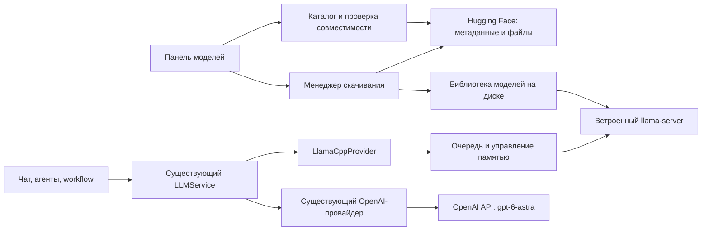

# Встроенные локальные модели: llama.cpp, каталог Hugging Face и OpenAI Astra

Дата проверки: 11 сентября 2026 года. Статус: исследование и план реализации, не реализованная интеграция.

Проект: `/Users/pc/Desktop/github/local-cognitive-AI-system`.

## Решение и границы этапа

Включить в поставку приложения собственный `llama-server`. Приложение запускает его, управляет моделями и завершает его при выходе. Пользователю достаточно установить наше приложение, открыть панель моделей, скачать подходящую модель и выбрать её для чата, агента или workflow. Отдельно устанавливать LM Studio, Ollama, Python, CMake или llama.cpp ему не потребуется.

Новый внутренний provider ID — `llamacpp`, отображаемое имя — «Локальные модели». ID `local` не использовать: в текущем коде это специальный локальный судья, который работает без LLM.

Сначала добавить и проверить новый путь, затем перенести настройки и удалить интеграции LM Studio/Ollama. Аккаунты приложения, удалённый сервер авторизации и личный кабинет — отдельный последующий проект. Локальная генерация после скачивания должна работать без аккаунта и интернета.

Предлагаемая схема:



## Что уже есть в проекте

| Наблюдение в текущем коде | Следствие для реализации |
| --- | --- |
| [electron/main.cjs](/Users/pc/Desktop/github/local-cognitive-AI-system/electron/main.cjs) запускает Express через `require(dist/src/index.js)` внутри Electron main. | Нативный инференс вынести в дочерний процесс; определить явные `start`/`dispose` для backend и движка. |
| [buildRuntime.ts](/Users/pc/Desktop/github/local-cognitive-AI-system/src/app/buildRuntime.ts:434) собирает провайдеры, агентов, локальные менеджеры и workflow. | Это основная точка подключения нового провайдера. Переписывать движок графов для llama.cpp не требуется. |
| [RuntimeManager.ts](/Users/pc/Desktop/github/local-cognitive-AI-system/src/app/RuntimeManager.ts:44) при изменении настроек создаёт новый runtime. Старый не освобождается; одновременные reload объединяются. | Долгоживущий локальный сервис должен переживать reload. Настройки применять последовательно, чтобы последнее обновление не терялось. |
| [LocalModelManager.ts](/Users/pc/Desktop/github/local-cognitive-AI-system/src/llm/LocalModelManager.ts) уже имеет общий контракт list/load/unload и объединяет повторные load одного ID. | Сохранить контракт. Добавить полноценное управление очередью, памятью и событиями ниже него. |
| [ModelCatalogService.ts](/Users/pc/Desktop/github/local-cognitive-AI-system/src/llm/ModelCatalogService.ts) показывает модели провайдеров. | Это не каталог скачивания. Разделить удалённый каталог, установленные файлы и модели в памяти. |
| [LLMRegistry.ts](/Users/pc/Desktop/github/local-cognitive-AI-system/src/llm/LLMRegistry.ts) устраняет дубликаты только по `model.id`, а при ошибке discovery подставляет default model. | Использовать ключ `(providerId, modelId)`. Не выдавать неустановленную локальную модель за доступную. Это особенно важно во время сосуществования трёх локальных провайдеров. |
| [OpenAICompatibleProvider.ts](/Users/pc/Desktop/github/local-cognitive-AI-system/src/llm/OpenAICompatibleProvider.ts:70) уже вызывает `/v1/responses`. | Переиспользовать HTTP-клиент и разбор ответа; управление локальным процессом оставить в отдельном адаптере. |
| [app.js](/Users/pc/Desktop/github/local-cognitive-AI-system/public/assets/app.js:2092) содержит панель моделей и жёсткие проверки `lmstudio`/`ollama`. | Добавление одного backend-класса недостаточно: потребуются изменения выбора моделей, статусов, настроек и fallback. |
| [TelegramBotTransport.ts](/Users/pc/Desktop/github/local-cognitive-AI-system/src/transports/telegram/TelegramBotTransport.ts:46) напрямую принимает `LMStudioManager`. | Перевести Telegram на общий менеджер до удаления LM Studio. |
| [app.js](/Users/pc/Desktop/github/local-cognitive-AI-system/public/assets/app.js:2784) уже показывает индикатор `.activity-scan` у агентов, как возле Interrupt. | Переиспользовать существующий вид, добавить правдивые фазы ожидания и загрузки. |
| [app.js](/Users/pc/Desktop/github/local-cognitive-AI-system/public/assets/app.js:306) по умолчанию обрывает HTTP через 30 секунд; проверка провайдера не переопределяет этот срок. | Согласовать UI и backend: тест тяжёлой локальной модели или Astra может оборваться в UI раньше серверного запроса. |

Старый пример из журнала пользователя — отмена через 20 секунд и ответ, содержащий только reasoning. Успешный HTTP-статус или `status: completed` без финального текста не должен считаться успешным ответом пользователю. Смена движка сама по себе не исправляет ошибки ожидания и обработки результата.

Существующий документ `architecture/task-board-fsm-logic-driver-investigation.md` описывает более раннее состояние. Для этой интеграции исходной точкой служат уже реализованные `WorkflowRunner`, `AgentNodeExecutor`, хранилища и React-редактор.

## Основание выбора llama.cpp

На дату проверки официальный релиз — [v0.4.0](https://github.com/ggml-org/llama.cpp/releases/tag/v0.4.0); его страница направляет к бинарным сборкам [b10809](https://github.com/ggml-org/llama.cpp/releases/tag/b10809). Зафиксировать конкретный build, платформенный архив и SHA-256. Номера версий здесь — исходная точка проверки, а не рекомендация автоматически скачивать `latest` при старте приложения.

В [документации сервера v0.4.0](https://github.com/ggml-org/llama.cpp/blob/v0.4.0/tools/server/README.md) подтверждены:

- `/v1/responses`, преобразующий запросы в Chat Completions;
- router mode с несколькими моделями и локальными INI presets;
- `GET /models`, `POST /models/load`, `POST /models/unload`, `GET /models/sse`;
- параметры `--models-max`, `--no-models-autoload`, состояния загрузки и SSE-события;
- собственная возможность скачивания моделей.

Для приложения предлагается один собственный менеджер скачивания и файловая библиотека. Встроенное скачивание сервера в этом варианте не использовать параллельно с ним. Сервер получает только проверенные локальные пути через presets. Его router health не заменяет проверку готовности конкретной модели. Точность процентов загрузки в память зависит от режима mmap; при отсутствии надёжной оценки показывать фазу и активность. Обновление списка presets выполнять без вмешательства в активную генерацию.

llama.cpp распространяется под [MIT](https://github.com/ggml-org/llama.cpp/blob/v0.4.0/LICENSE): включить необходимые уведомления в поставку. Лицензии скачиваемых моделей проверять отдельно. Сам движок поддерживает разные аппаратные backend, включая Metal, CPU и Vulkan/CUDA; выбор готовой сборки должен соответствовать нашей матрице платформ. [Основной репозиторий](https://github.com/ggml-org/llama.cpp).

## Как это должно выглядеть для пользователя

1. Открывает «Модели». Внутри панели доступны «Каталог» и «На устройстве». Чат и установленная библиотека открываются даже при недоступности Hugging Face.
2. Видит совместимые варианты: название, автор, размер скачивания, квантование, примерные требования к памяти, лицензию и состояние. По умолчанию — проверенная подборка; поиск по Hugging Face доступен отдельно.
3. Нажимает «Скачать». Показываются объём, процент, скорость, пауза, продолжение и отмена. Скачивается выбранное квантование со всеми необходимыми частями, а не весь репозиторий со всеми вариантами.
4. После проверки файлов модель появляется в «На устройстве». Кнопка «Использовать» назначает её текущему чату; при необходимости пользователь отдельно делает её моделью по умолчанию.
5. При первом запросе приложение само загружает модель в память. Для агента отображаются «Ожидает», «Загружает модель», «Генерирует», затем «Готово», «Ошибка» или «Прервано». Выбор модели для агента или workflow использует ту же библиотеку и тот же путь выполнения.
6. «Выгрузить из памяти» освобождает память и сохраняет файлы. «Удалить с устройства» удаляет только принадлежащие приложению файлы выбранной модели, если они не используются.

Три независимых состояния:

| Объект | Состояния |
| --- | --- |
| Скачивание | queued → downloading ↔ paused → verifying → completed; failed / cancelled |
| Модель в памяти | unloaded → loading → ready → unloading; error |
| Конкретный вызов агента | queued → loading → generating → completed; failed / cancelled |

Файлы могут быть скачаны, пока модель выгружена. Два агента могут выбрать одну модель, но находиться в разных состояниях очереди. Процент скачивания считать по байтам; для генерации использовать индикатор активности, время и доступные метрики, без выдуманного процента завершения.

Каталог должен предлагать GGUF, совместимые с зафиксированным runtime. Тег GGUF сам по себе не гарантирует поддержку архитектуры или достаточную память. Для первого выпуска ограничить обещание текстовыми моделями; MLX и обычные safetensors не импортировать как готовые к llama.cpp. Мультимодальность и дополнительные projector-файлы включать только после отдельной проверки. [GGUF на Hugging Face](https://huggingface.co/docs/hub/gguf).

Для каталога и метаданных подходит официальный `@huggingface/hub`, для чтения GGUF-метаданных — `@huggingface/gguf`; Python не нужен. Конкретные версии пакетов проверить с текущим CommonJS backend, Node и Electron. [Hub JS](https://huggingface.co/docs/huggingface.js/hub/README), [GGUF JS](https://huggingface.co/docs/huggingface.js/gguf/README).

Публичная подборка работает без HF-логина. Для gated-моделей требуется собственный доступ пользователя на Hugging Face и его токен; аккаунт нашего приложения это не заменяет. В первом выпуске такие модели можно обозначать как требующие доступа и исключить из кнопки немедленного скачивания. [Gated models](https://huggingface.co/docs/hub/models-gated).

## Файлы, которые нужно добавить

Ниже новые пути относительно корня проекта; они пока не созданы. Разделение на файлы — предлагаемая структура реализации.

| Новый файл | Ответственность |
| --- | --- |
| `resources/llama/runtime-manifest.json` | Build/commit, OS, CPU architecture, GPU backend, URL архива, SHA-256, имена executable и библиотек. Никаких плавающих `latest`. |
| `resources/llama/THIRD_PARTY_NOTICES.txt` | Лицензия llama.cpp и уведомления зависимостей, которые действительно входят в выбранные сборки. |
| `scripts/prepare-llama-runtime.mjs` | Подготовка платформенных ресурсов при сборке: загрузка/сборка, проверка хеша, распаковка, проверка `--version`. Пользовательский запуск приложения ничего не компилирует. |
| `scripts/verify-packaged-runtime.mjs` | Проверка наличия и запуска движка из готового `.app`/Windows-пакета, зависимых библиотек, путей с пробелами и architecture. |
| `resources/models/recommended.json` | Небольшая проверенная подборка: repo, revision, вариант файлов, поддержанный runtime/backend и результаты проверки возможностей. |
| `src/local/types.ts` | Контракты каталога, артефактов, установленной модели, скачивания, runtime snapshot, совместимости и событий. |
| `src/local/LocalModelService.ts` | Один долгоживущий владелец библиотеки, скачиваний, очереди и runtime. `init`, `reconfigure`, `dispose`; независимость от пересоздания агентов. |
| `src/local/LlamaCppRuntime.ts` | Запуск и остановка процесса/router, генерация безопасных presets, readiness, подписка на события, диагностика, обработка падения и повторного запуска. |
| `src/local/ModelLibraryStore.ts` | Устойчивые ID и manifest установленных файлов, jobs скачивания, атомарные записи, восстановление после перезапуска, удаление и импорт GGUF. |
| `src/local/HuggingFaceCatalog.ts` | Поиск с пагинацией, cache метаданных, repo/revision/files/license, объединение shards одного варианта. HF-запросы не блокируют bootstrap приложения. |
| `src/local/ModelCompatibility.ts` | Проверка формата, архитектуры, шаблона диалога, доступного backend, места на диске и оценка RAM/VRAM с учётом контекста и KV cache. |
| `src/local/ModelDownloadService.ts` | Скачивание потоками в `.part`, прогресс, сохранённые jobs, pause/resume/cancel, повтор после сетевого сбоя, контроль размера/целостности и публикация готового набора файлов. |
| `src/local/LocalInferenceScheduler.ts` | Общая очередь всех локальных вызовов, предел одновременно работающих моделей, временное закрепление модели на время запроса, отмена ожидания и освобождение ресурсов в `finally`. |
| `src/llm/LlamaCppProvider.ts` | Адаптер `LLMProvider`: разрешить ID библиотеки, дождаться допуска и готовности модели, выполнить запрос через существующий совместимый HTTP-клиент, вернуть обычный `LLMResponse`. |
| `src/llm/LlamaCppModelManager.ts` | Реализация существующего `LocalModelManager`: установленные/загруженные модели, load/unload, проверка занятости, согласование идентификаторов библиотеки и router. |
| `src/llm/ProviderCapabilities.ts` | Общие признаки local/remote, managed, json mode, reasoning и ограничения запросов. Возможности уточняются для модели, а не угадываются по её названию. |
| `src/llm/ProviderTargetResolver.ts` | Разрешение пары provider/model, в том числе явно настроенных соответствий старых моделей новым. Ошибка выбора вместо незаметной подмены модели. |
| `src/api/localModelControllers.ts` | API каталога, скачиваний, установленной библиотеки, SSE и runtime snapshot; валидация входных данных. |
| `public/assets/model-manager.js` | Изолированный модуль панели: каталог, фильтры, варианты модели, библиотека, прогресс, команды и подписка на события. Импортировать из текущего `app.js`. |
| `src/app/migrations/localModelProviderMigration.ts` | Версионированная, повторяемая миграция с backup и отчётом: provider/model mappings, настройки сессий, новые версии workflow, unresolved targets. |

Если поддержка gated-моделей входит в первый выпуск, дополнительно добавить `src/app/CredentialStore.ts` и `electron/credentials.cjs`: интерфейс хранения токенов и реализацию через защищённое хранилище ОС. Тот же механизм можно использовать для собственного OpenAI API key пользователя. Renderer получает признак наличия ключа, а не ключ в bootstrap. [Electron safeStorage](https://www.electronjs.org/docs/latest/api/safe-storage).

## Изменения существующих файлов

### Подключение и жизненный цикл

| Файл | Что изменить |
| --- | --- |
| [package.json](/Users/pc/Desktop/github/local-cognitive-AI-system/package.json) | Добавить зависимости каталога/метаданных и команды подготовки/проверки runtime. В `electron-builder` включить платформенные executable, библиотеки, notices и подборку моделей через `extraResources`. Проверить подпись/notarization готовых пакетов. |
| [package-lock.json](/Users/pc/Desktop/github/local-cognitive-AI-system/package-lock.json) | Зафиксировать выбранные версии JS-зависимостей после проверки их совместимости. |
| [.gitignore](/Users/pc/Desktop/github/local-cognitive-AI-system/.gitignore) | Исключить скачанные бинарные архивы, dev-библиотеку GGUF, partial downloads и отчёты прогонов. Manifest версий и подборку оставить в Git. |
| [electron/main.cjs](/Users/pc/Desktop/github/local-cognitive-AI-system/electron/main.cjs) | Передать пути `process.resourcesPath` и пользовательских данных, получить backend handle, вызвать `dispose` при выходе. Ограничить повторный запуск экземпляра приложения. Добавить выбор папки/файла через узкий IPC. |
| [electron/preload.cjs](/Users/pc/Desktop/github/local-cognitive-AI-system/electron/preload.cjs) | Предоставить только операции выбора папки моделей/импорта. Сохранить `contextIsolation` и отсутствие Node в renderer. |
| [src/index.ts](/Users/pc/Desktop/github/local-cognitive-AI-system/src/index.ts) | Экспортировать запуск backend с возвращаемым `dispose`; сохранить headless entry. Создать локальные сервисы один раз, сохранить handles HTTP/таймеров/транспортов для остановки. |
| [src/mcp.ts](/Users/pc/Desktop/github/local-cognitive-AI-system/src/mcp.ts) | Использовать такую же инициализацию сервисов и освобождение ресурсов при EOF/завершении MCP. Задавать пути runtime явно для headless-запуска. |
| [src/app/RuntimeManager.ts](/Users/pc/Desktop/github/local-cognitive-AI-system/src/app/RuntimeManager.ts) | Передавать живой `LocalModelService` новым runtime, последовательно применять настройки. Не пересоздавать процесс и скачивания на каждом save. |
| [src/app/buildRuntime.ts](/Users/pc/Desktop/github/local-cognitive-AI-system/src/app/buildRuntime.ts) | Зарегистрировать `llamacpp`, его менеджер и descriptors; убрать ручные карты default model и локальных таймаутов. Учитывать `enabled` при доступности провайдеров. Обновить `AppRuntime`, Telegram и AgentNodeExecutor dependencies. |

Ресурсы поставки должны быть доступны как обычные файлы, вне архива JavaScript-приложения. Текущий `asar: false` это допускает; `extraResources` отделяет нативные файлы от исходного кода приложения. [electron-builder: contents](https://www.electron.build/configuration/contents).

### Настройки, выбор модели и ответ

| Файл | Что изменить |
| --- | --- |
| [src/config/config.ts](/Users/pc/Desktop/github/local-cognitive-AI-system/src/config/config.ts) | Добавить типизированный `localModels` и provider `llamacpp`: папки, runtime backend, контекст, лимит памяти/моделей, таймауты. Для новой установки — локальный провайдер с пустым выбором до первого скачивания. |
| [src/app/AppSettingsStore.ts](/Users/pc/Desktop/github/local-cognitive-AI-system/src/app/AppSettingsStore.ts) | Сохранять и валидировать новые параметры; добавить schema version и миграции. Обновление default значений не должно оставлять активными старые 20-секундные значения для нового пути. |
| [src/types/index.ts](/Users/pc/Desktop/github/local-cognitive-AI-system/src/types/index.ts) | Расширить settings/patch, descriptors/capabilities и metadata модели. Добавить progress callback в LLMRequest и явные настройки reasoning/общего output budget. Совместимо расширить ManagedModel, сохранив существующие поля на переходном этапе. |
| [src/llm/LLMProvider.ts](/Users/pc/Desktop/github/local-cognitive-AI-system/src/llm/LLMProvider.ts) | Уточнить контракт capabilities и отсутствия выбранной локальной модели; генерация получает события через LLMRequest. |
| [src/llm/LLMRegistry.ts](/Users/pc/Desktop/github/local-cognitive-AI-system/src/llm/LLMRegistry.ts) | Исправить dedup по паре provider/model; отличать ошибку discovery от отсутствия установленной модели. |
| [src/llm/ModelCatalogService.ts](/Users/pc/Desktop/github/local-cognitive-AI-system/src/llm/ModelCatalogService.ts) | Возвращать модели, которые можно выбрать для выполнения. Удалённые несохранённые GGUF остаются в отдельном каталоге. |
| [src/llm/LocalModelManager.ts](/Users/pc/Desktop/github/local-cognitive-AI-system/src/llm/LocalModelManager.ts) | Добавить новый менеджер; сохранить dedup загрузок. Ошибка одного внешнего провайдера не должна ломать всю библиотеку; занятость unload проверяет локальный сервис. |
| [src/llm/LLMService.ts](/Users/pc/Desktop/github/local-cognitive-AI-system/src/llm/LLMService.ts) | Применять target resolver и capabilities, включать JSON mode по возможности модели вместо `providerId === openai`. Передавать progress/cancel и не повышать явный лимит пользователя молча. |
| [src/llm/OpenAICompatibleProvider.ts](/Users/pc/Desktop/github/local-cognitive-AI-system/src/llm/OpenAICompatibleProvider.ts) | Переиспользовать для Responses; добавить поддерживаемые reasoning-параметры, разбор тела HTTP-ошибки, корректную проверку ключа для настоящего OpenAI. У локального runtime URL/token служебные, не пользовательские настройки. |
| [src/llm/provider-utils.ts](/Users/pc/Desktop/github/local-cognitive-AI-system/src/llm/provider-utils.ts) | Сохранить разделение reasoning/final answer и `incomplete`; различать отмену, timeout, HTTP-ошибку и пустой ответ. Поддержать диагностику контекста, лимита токенов и rate limits. |
| [src/session/SessionSettingsStore.ts](/Users/pc/Desktop/github/local-cognitive-AI-system/src/session/SessionSettingsStore.ts) | Применять модель по умолчанию правильного провайдера, миграцию/валидацию targets. При смене provider не переносить случайно модель предыдущего provider. Сохранить особый `local` judge. |
| [src/core/CognitiveEngine.ts](/Users/pc/Desktop/github/local-cognitive-AI-system/src/core/CognitiveEngine.ts) | Разрешать эффективную пару provider/model до исполнения; явный provider override не должен наследовать чужую session model. Отражать фактически использованную модель в результате. |

### API, интерфейс и все способы запуска

| Файл | Что изменить |
| --- | --- |
| [src/api/routes.ts](/Users/pc/Desktop/github/local-cognitive-AI-system/src/api/routes.ts) | Подключить новые model controllers; сохранить `/local/models/*`. `/lmstudio/*` убрать только на финальном этапе. |
| [src/api/controller.ts](/Users/pc/Desktop/github/local-cognitive-AI-system/src/api/controller.ts) | Bootstrap отдаёт быстрые snapshots библиотеки/runtime, не ждёт HF. Убрать fallback `lmstudio` при сохранении агентов, скорректировать проверку провайдера и выдачу настроек. |
| [public/assets/app.js](/Users/pc/Desktop/github/local-cognitive-AI-system/public/assets/app.js) | Подключить модуль панели, выбирать установленные модели во всех селекторах, заменить hardcoded local-проверки capabilities. Обновлять состояние через события, сохранять выбранную модель после unload. Согласовать сроки проверки провайдера/загрузки/генерации с backend. Добавить Astra в подсказки, сохранив ручной ввод ID. |
| [public/assets/app.css](/Users/pc/Desktop/github/local-cognitive-AI-system/public/assets/app.css) | Переиспользовать `.activity-scan`; добавить determinate download progress, состояния и доступные подписи. |
| [public/assets/liquid-glass.css](/Users/pc/Desktop/github/local-cognitive-AI-system/public/assets/liquid-glass.css) | Оформление каталога и прогресса с учётом финальных переопределений темы, светлого/тёмного режима. |
| [frontend/workflow/types.ts](/Users/pc/Desktop/github/local-cognitive-AI-system/frontend/workflow/types.ts) | Дополнить ProviderOption состоянием/возможностями установленных моделей и недоступных сохранённых targets. |
| [frontend/workflow/WorkflowEditor.tsx](/Users/pc/Desktop/github/local-cognitive-AI-system/frontend/workflow/WorkflowEditor.tsx) | Показывать новые модели и объяснять отсутствие старой; сохранённый выбор не стирать при временной недоступности runtime. |
| [src/transports/telegram/TelegramBotTransport.ts](/Users/pc/Desktop/github/local-cognitive-AI-system/src/transports/telegram/TelegramBotTransport.ts), [TelegramHelp.ts](/Users/pc/Desktop/github/local-cognitive-AI-system/src/transports/telegram/TelegramHelp.ts), [ModelAliases.ts](/Users/pc/Desktop/github/local-cognitive-AI-system/src/transports/telegram/ModelAliases.ts) | Общий LocalModelManagerRegistry вместо LMStudioManager; load/unload/use с provider-aware aliases. |
| [src/transports/mcp/tools.ts](/Users/pc/Desktop/github/local-cognitive-AI-system/src/transports/mcp/tools.ts) | Каталог установленных моделей и descriptions для нового провайдера. Новые инструменты скачивания не обязательны для первого UI-выпуска. |
| [src/utils/startupSummary.ts](/Users/pc/Desktop/github/local-cognitive-AI-system/src/utils/startupSummary.ts) | Выводить версию runtime, backend, библиотеку и причину недоступности без токенов и ключей. |

`public/index.html` менять не требуется при импорте нового ES-модуля из `app.js`. `frontend/workflow/index.tsx` менять только при изменении props моста. `public/assets/workflow-editor.js` и CSS генерируются сборкой; вручную их не редактировать.

### Оркестрация и прогресс

| Файл | Что изменить |
| --- | --- |
| [src/core/AgentProgressReporter.ts](/Users/pc/Desktop/github/local-cognitive-AI-system/src/core/AgentProgressReporter.ts) | Связать progress конкретного LLM-вызова с конкретным агентом: очередь, cold load, генерация. Не отмечать ожидающего агента как уже генерирующего. |
| [src/app/buildRuntime.ts](/Users/pc/Desktop/github/local-cognitive-AI-system/src/app/buildRuntime.ts) | В general/code handlers передавать callback очереди/загрузки; каждый вызов получает и освобождает доступ отдельно. |
| [src/agents/code/codeAgentRouting.ts](/Users/pc/Desktop/github/local-cognitive-AI-system/src/agents/code/codeAgentRouting.ts) | Убрать специальную классификацию только LM Studio/Ollama; учитывать capabilities нового провайдера. Согласовать с UI-ранжированием агентов. |
| [src/agents/HypothesisAgent.ts](/Users/pc/Desktop/github/local-cognitive-AI-system/src/agents/HypothesisAgent.ts), [SupportAgent.ts](/Users/pc/Desktop/github/local-cognitive-AI-system/src/agents/SupportAgent.ts), [AttackAgent.ts](/Users/pc/Desktop/github/local-cognitive-AI-system/src/agents/AttackAgent.ts), [HypothesisAdvisorAgent.ts](/Users/pc/Desktop/github/local-cognitive-AI-system/src/agents/HypothesisAdvisorAgent.ts), [src/judge/Judge.ts](/Users/pc/Desktop/github/local-cognitive-AI-system/src/judge/Judge.ts) | Пробросить progress участников; отделить желаемую длину текста от общего бюджета reasoning-модели. Сохранить обработку деградации и отмены. |
| [src/llm/LanguageEnforcer.ts](/Users/pc/Desktop/github/local-cognitive-AI-system/src/llm/LanguageEnforcer.ts) | Перевод — отдельный вызов той же очереди с signal/progress; не удерживать доступ к модели между основным вызовом и переводом. |
| [src/workflows/nodes/AgentNodeExecutor.ts](/Users/pc/Desktop/github/local-cognitive-AI-system/src/workflows/nodes/AgentNodeExecutor.ts) | Использовать разрешённый target, передавать progress в node run, сообщать ошибку недоступной модели через существующий результат узла. |
| [src/workflows/nodes/NodeExecutor.ts](/Users/pc/Desktop/github/local-cognitive-AI-system/src/workflows/nodes/NodeExecutor.ts), [WorkflowRunner.ts](/Users/pc/Desktop/github/local-cognitive-AI-system/src/workflows/WorkflowRunner.ts), [WorkflowRunStore.ts](/Users/pc/Desktop/github/local-cognitive-AI-system/src/workflows/WorkflowRunStore.ts), [types.ts](/Users/pc/Desktop/github/local-cognitive-AI-system/src/workflows/types.ts) | Добавить канал и snapshot progress узла с ограничением частоты сохранения; игнорировать поздние события завершённого/отменённого run. |
| [frontend/workflow/workflowAdapter.ts](/Users/pc/Desktop/github/local-cognitive-AI-system/frontend/workflow/workflowAdapter.ts), [FsmNode.tsx](/Users/pc/Desktop/github/local-cognitive-AI-system/frontend/workflow/FsmNode.tsx) | Отобразить фазу работающего узла, если progress показывается на графе. Механизм переходов FSM оставить прежним. |

## Хранилище, ресурсы и ожидание

Предлагаемые места для весов:

- macOS: `~/Library/Application Support/local-cognitive-ai-system/models`;
- Windows: `%LOCALAPPDATA%/local-cognitive-ai-system/models`;
- возможность выбрать другой диск; файлы не помещать внутрь `.app`, installer или roaming-профиля Windows.

Метаданные и журнал скачиваний хранить под `APP_DATA_DIR/local-models`; существующие `app/settings.json` и настройки сессий остаются отдельными. На диске библиотека привязана к repo + immutable revision + набору файлов/хешей. В UI используется стабильный внутренний ID; имя модели не служит путём. Shards одного варианта публикуются как готовая модель только после проверки всего набора. Внешний импорт помечается отдельно от принадлежащих приложению файлов.

Менеджер скачивания должен проверять поддержку HTTP Range, согласованность revision/ETag и размер ответа; если докачка невозможна, явно начинать файл заново. Сохранять задания перед завершением приложения. `.part` не попадает в inference. Не загружать многогигабайтный GGUF целиком в JS-память; чтение метаданных и проверки выполнять ограниченными порциями, длительные CPU-операции — вне UI/main event loop.

Все локальные вызовы проходят через один scheduler: main model, code agents, support/attack/judge, перевод и workflow. Для первого выпуска безопасная отправная точка — одна активная модель/генерация; несколько агентов выполняются с видимым ожиданием. Более высокая параллельность включается после измерений на машине пользователя. Память оценивать как веса + KV cache + рабочие буферы + запас системе. На Apple Silicon не складывать RAM и VRAM как независимые объёмы.

Повторные запросы к одной загружающейся модели ждут общий load. Отмена одного ожидающего не отменяет чужой запрос. Unload/delete занятой модели возвращает понятное состояние busy. При падении runtime активные запросы завершаются ошибкой, очередь освобождается; автоматическое повторение завершённых генераций или tool-действий запрещено логикой сервиса. Новый запрос может инициировать контролируемый перезапуск процесса.

Приложение владеет runtime один раз за жизненный цикл, на loopback с приватным служебным токеном и динамическим портом. Дочерние worker-процессы также должны завершаться при выходе на macOS и Windows. Отдельно проверить force quit и падение родителя. Для headless/MCP определить одного владельца на библиотеку: не запускать второй независимый scheduler поверх тех же активных моделей. При совместном запуске использовать сервис владельца; если подключения нет, сообщать конфликт владельца. Существующий `withFileLock` защищает только один Node-процесс, поэтому межпроцессное владение требует отдельного механизма.

Разделить сроки: discovery/control, загрузка модели, очередь и генерация. Начальные настраиваемые бюджеты для проверки — до 5 минут на cold load и до 10 минут на тяжёлую генерацию; подтвердить их реальными замерами. Ожидание очереди не расходует generation budget. UI получает прогресс и общий deadline, а не применяет к любой операции 30 секунд. Скачивание имеет контроль отсутствия прогресса и восстановления, а не фиксированный лимит в 20 секунд. Для очень длинных цепочек использовать существующее отслеживание run с явным статусом, согласовав время жизни HTTP-запроса и отмену backend.

## API приложения

Эти маршруты принадлежат нашему Express API; renderer не обращается к внутреннему llama-server напрямую.

| Маршрут | Назначение |
| --- | --- |
| `GET /local/catalog?q=...&cursor=...` | Поиск/подборка совместимых вариантов и следующая страница. |
| `GET /local/catalog/model?repoId=...&revision=...` | Файлы, размеры, лицензия и варианты конкретного репозитория. |
| `POST /local/downloads` | `{repoId, revision, variantId}` → `202` с `downloadId`. Сервер сам разрешает файлы и destination. |
| `GET /local/downloads` | Сохранённые задания и прогресс. |
| `POST /local/downloads/:id/pause` / `resume` / `cancel` | Управление скачиванием; повторные команды безопасны. |
| `GET /local/models/all` / `loaded` | Существующие маршруты, дополненные состоянием новой библиотеки. |
| `POST /local/models/load` / `unload` | Существующие provider-aware команды; успешное завершение означает подтверждённое состояние. Прогресс приходит отдельно. |
| `POST /local/models/import` | Импорт выбранного локального набора GGUF через проверенный backend-путь. |
| `DELETE /local/models/:libraryId` | Удаление с устройства с проверкой владения файлами и активного использования. |
| `GET /local/runtime` | Runtime version/backend/status и ограничения ресурсов, без служебного токена. |
| `GET /local/events` | SSE: download/model/runtime events с ID и sequence; после reconnect — свежий snapshot. |

Сохранить существующие `/chat`, `/process`, `/process-runs`, workflow/task API. Скачивание не должно происходить незаметно из обычного запроса агента: если файла нет, вернуть необходимость выбрать/скачать модель.

## Удаление LM Studio и Ollama после готовности замены

1. Выпустить рабочий новый модуль, сохранив старые провайдеры на период проверки. Не менять существующий пользовательский выбор при простом обновлении приложения.
2. Построить отчёт используемых targets: app default, session default, code/hypothesis agents, debate roles, workflow definitions и незавершённые runs со snapshots.
3. Сопоставлять `(старый providerId, старый modelId)` с конкретным новым library ID только по подтверждённому артефакту или явному выбору пользователя. Простая замена строки provider недостаточна. Старые MLX-модели и Ollama aliases могут не иметь прямого GGUF-соответствия.
4. Сохранить backup и migration version. Новые workflow-версии используют новый target. Историю сообщений, происхождение старых ответов и snapshots выполненных runs не переписывать. Для старых pending/scheduled runs применять согласованное соответствие при исполнении и сохранять фактический target в новом результате. Unresolved target должен остановить выполнение с объяснением, без автоматической отправки в облако.
5. После приёмки удалить [LMStudioManager.ts](/Users/pc/Desktop/github/local-cognitive-AI-system/src/llm/LMStudioManager.ts), [OllamaModelManager.ts](/Users/pc/Desktop/github/local-cognitive-AI-system/src/llm/OllamaModelManager.ts), [OllamaProvider.ts](/Users/pc/Desktop/github/local-cognitive-AI-system/src/llm/OllamaProvider.ts), старую регистрацию, настройки/UI/help и `/lmstudio/*` controllers/routes.
6. Сохранить [OpenAICompatibleProvider.ts](/Users/pc/Desktop/github/local-cognitive-AI-system/src/llm/OpenAICompatibleProvider.ts): он нужен OpenAI и новому локальному адаптеру. Сохранить общие registry и контракт менеджера.

Дополнительные файлы финальной очистки: [README.md](/Users/pc/Desktop/github/local-cognitive-AI-system/README.md), [.env.example](/Users/pc/Desktop/github/local-cognitive-AI-system/.env.example), [local-cognitive.config.example.json](/Users/pc/Desktop/github/local-cognitive-AI-system/local-cognitive.config.example.json), [local-cognitive.schema.json](/Users/pc/Desktop/github/local-cognitive-AI-system/local-cognitive.schema.json), [data/app/settings.example.json](/Users/pc/Desktop/github/local-cognitive-AI-system/data/app/settings.example.json), [ResponseFormatter.ts](/Users/pc/Desktop/github/local-cognitive-AI-system/src/core/ResponseFormatter.ts). Схема сейчас описывает в основном MCP: добавить реальное описание новых локальных настроек. В formatter оставить возможность читать исторические ответы LM Studio.

После удаления допустимы упоминания старых провайдеров в миграциях, историческом отображении и тестовых fixtures. Исполняемых вызовов их API остаться не должно. Удаление модулей нашего приложения не удаляет LM Studio/Ollama или их файлы с компьютера пользователя.

## Проверки и последовательность реализации

Новые тестовые файлы:

| Файл | Что проверяет |
| --- | --- |
| `test/llamaCppRuntime.test.ts` | Lifecycle/reload/crash, fake server contracts, очередь, dedup load, cancel и освобождение модели. |
| `test/modelDownloads.test.ts` | Обрыв и докачку, смену revision, повреждение файла, нехватку диска, shards, восстановление jobs, безопасные пути. |
| `test/localModelMigration.test.ts` | Старые настройки, неоднозначные ID, MLX, pending workflows и неизменность истории/snapshots. |
| `test/openaiProvider.test.ts` | Запрос Astra, reasoning/output budgets, JSON, тела ошибок 401/403/429, incomplete/reasoning-only и отмену. |
| `test/llamaCpp.integration.test.ts` | Явно включаемый прогон настоящего runtime и GGUF; отсутствие файлов обозначается как skipped, не как успешный inference. |
| `test/e2e/local-models.spec.ts` | Полный путь в Electron: каталог → скачать → использовать → ответ → restart → offline. Подключить отдельную команду и нужную тестовую зависимость в package.json. |

Расширить существующие [local-model-runtime.test.ts](/Users/pc/Desktop/github/local-cognitive-AI-system/test/local-model-runtime.test.ts), [chat-ui-regressions.test.ts](/Users/pc/Desktop/github/local-cognitive-AI-system/test/chat-ui-regressions.test.ts), [orchestration-regressions.test.ts](/Users/pc/Desktop/github/local-cognitive-AI-system/test/orchestration-regressions.test.ts), [workflows.test.ts](/Users/pc/Desktop/github/local-cognitive-AI-system/test/workflows.test.ts), [process-run.test.ts](/Users/pc/Desktop/github/local-cognitive-AI-system/test/process-run.test.ts) и [telegramTransport.test.ts](/Users/pc/Desktop/github/local-cognitive-AI-system/test/telegramTransport.test.ts). В [ollamaModelManager.test.ts](/Users/pc/Desktop/github/local-cognitive-AI-system/test/ollamaModelManager.test.ts) сначала перенести общие registry-проверки, затем удалить только специфичные Ollama-тесты вместе с модулем.

Порядок поставки:

1. Бинарная поставка + lifecycle + одна настоящая локальная генерация из собранного приложения.
2. Библиотека + совместимость + скачивание/докачка + панель моделей.
3. Общий provider/scheduler + выбор во всех агентах и workflow + progress/cancel.
4. Приёмка на целевых платформах и миграция сохранённых targets.
5. Удаление LM Studio/Ollama и повторная приёмка без запущенных/установленных внешних приложений.

Обязательные результаты приёмки:

- Чистая установка без LM Studio/Ollama: модель выбирается и скачивается из панели, первый запуск сразу даёт непустой финальный ответ.
- Повторный запуск без интернета: установленная модель доступна, сохранённые настройки не сброшены.
- Прерывание скачивания и перезапуск приложения: корректная докачка или объяснимый перезапуск файла, без повреждённой «готовой» модели.
- Проверка реальной reasoning-модели: длительное размышление не обрывается через 20/30 секунд, reasoning-only/incomplete не маскируется под ответ.
- Главная модель + два агента на одной модели и на разных моделях: очередь видна, память ограничена, итог содержит реальные ответы.
- Debate, judge, translation и сохранённый workflow с переходом к human review и terminal: тот же путь через новый provider.
- Interrupt во время ожидания, загрузки и генерации: нет позднего текста и ложного успеха, чужой активный запрос не отменён.
- Unload/reload, нехватка памяти, падение runtime и обновление настроек во время работы: приложение остаётся управляемым, загрузки и ответы имеют конечный статус.
- macOS arm64, macOS x64 и Windows x64 — текущие цели package.json. Начать с Metal/CPU на macOS и проверенного CPU-варианта Windows; GPU-вариант Windows заявлять после реальной проверки Vulkan/CUDA и комплектности библиотек. Непроверенная платформа явно отмечается.
- Telegram/MCP и scheduled workflows используют новый менеджер; старые provider IDs обрабатываются миграцией, а не случайным fallback.
- Для каждого реального прогона сохранить build runtime, model revision/хеш, OS/backend, длительность, финальный ответ и результат. Unit-тесты HTTP-заглушек не заменяют эту проверку.

## OpenAI Astra: доступность и соответствие текущему коду

Да, Astra доступна через публичный OpenAI API с ID `gpt-6-astra`. Официальная страница подтверждает Responses, streaming и structured outputs. Free API tier не поддерживается; доступ конкретного проекта и ключа нужно проверять отдельно. [GPT-6 Astra](https://developers.openai.com/api/docs/models/gpt-6-astra).

Минимальная конфигурация существующего провайдера:

```text
Provider: openai
Base URL: https://api.openai.com/v1
Model: gpt-6-astra
API key: собственный ключ OpenAI API пользователя
```

В текущем коде нет запрета на такой model ID. Он уже передаётся как строка в `POST /responses` вместе с `input` и `instructions`. Следовательно, для базового текстового запроса новый AstraProvider не нужен. Статические подсказки UI устарели, но ручной ввод модели поддерживается.

Для надёжного использования агентами нужны следующие изменения:

- В `LLMRequest`, provider settings и HTTP-клиенте дать возможность задавать `reasoning.effort`. Astra поддерживает `low`, `medium`, `high`, `xhigh`, `max`; не предлагать ей `none`/`minimal`.
- Не отправлять Astra `temperature`, `top_p`, `top_logprobs`. Текущий OpenAICompatibleProvider их и так не сериализует — это поведение сохранить.
- Оставить Responses API; поддержка provider-native tool calling потребует отдельного контракта tools/results. Нынешняя оркестрация приложения может использовать Astra как обычного участника через существующий текст/JSON-путь. Доступные Astra возможности не включаются в приложении автоматически. [Руководство Astra](https://developers.openai.com/api/docs/guides/latest-model).
- Исправить 30-секундный UI timeout проверки провайдера и согласовать длительные запросы. В коде general-запрос опирается на timeout провайдера, code agents имеют отдельный минимум ожидания.
- Пересмотреть бюджет Support/Attack/Advisor/Judge: сейчас он задаётся стилем ответа, например 1200/2200 токенов у Support. У reasoning-моделей `max_output_tokens` включает и размышление, и видимый результат; малый лимит может закончиться до финального текста. Разделить длину ответа и общий вычислительный бюджет, не увеличивая явный лимит пользователя молча. [Reasoning models](https://developers.openai.com/api/docs/guides/reasoning).
- Показывать тело API-ошибки с понятной причиной доступа/квоты, а не только HTTP status. Ключ проверять как ключ OpenAI API; существующая сессия Codex сама по себе не проверяет доступ этого приложения. [API authentication](https://developers.openai.com/api/reference/overview).

Файлы Astra перечислены выше: types/config/settings, OpenAICompatibleProvider/provider-utils, LLMService/capabilities, агенты с бюджетами, UI и тесты. Модель по умолчанию пользователя автоматически на Astra не менять.

Проверка доступности для конкретного пользователя: сначала запрос модели с его API key, затем маленький явный `/v1/responses`-запрос и проверка финального текста, после этого JSON/debate и Interrupt. В рамках этого исследования API key не использовался и платный запрос к Astra не выполнялся. Вывод подтверждён официальной документацией и анализом кода, а не реальным прогоном Astra из приложения.

## Аккаунты и личный кабинет — позже

Текущий Express backend работает на устройстве пользователя. Его достаточно для библиотеки, скачиваний, очереди и локального инференса. Для аккаунтов потребуется отдельный удалённый сервис: авторизация, пользовательские данные, сессии, восстановление доступа и API личного кабинета; desktop станет его клиентом.

На текущем этапе оставить границы для будущего подключения: отдельный CredentialStore, явный владелец данных и возможность добавить облачный provider. Не делать локальную модель зависимой от будущего логина. `ActorContext.userId` и `memory.localProfileId` уже существуют, но не являются реализованной системой аутентификации.

Если позже запросы Astra оплачивает сервис, общий ключ хранится на удалённом backend. В варианте BYOK пользователь использует свой API key; в дистрибутив общий ключ не включается. UI личного кабинета и сервер аккаунтов не входят в этот план реализации локальных моделей.

## Что сделано в этом исследовании

Проверены текущая рабочая копия, GitHub llama.cpp и официальные документы Hugging Face/OpenAI/Electron. Создан только этот план. Интеграция не установлена, веса не скачивались, inference через встроенный llama.cpp и Astra не запускался. Уже существовавшие изменения в `frontend/workflow/WorkflowEditor.tsx`, `frontend/workflow/index.tsx`, `public/assets/app.js`, `public/assets/liquid-glass.css` не изменялись.
