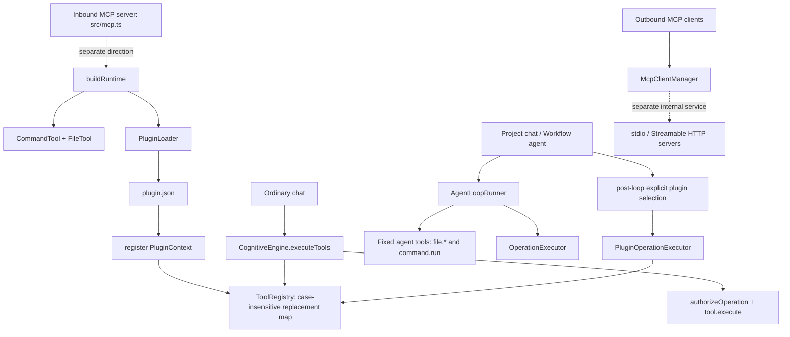

# Plugin module: current implementation

Verified against the local working tree on 30 September 2026. This is an implementation description, not the proposed PluginManager/MCP/OAuth release design in [Settings, Profile, Usage, and Plugins: implementation scope](settings-profile-plugins-implementation-scope.md). The working tree is the source of truth; no runtime code was changed for this documentation update.

## What is implemented

The current plugin mechanism is an **in-process Node/TypeScript module loader**. It is not an installable Agent Plugins client, catalog, marketplace, or an outbound-MCP-to-model bridge.

- `src/plugins/PluginLoader.ts` creates the configured plugin directory, visits immediate child directories, reads each `plugin.json`, and skips a manifest or configured override with `enabled: false`.
- The manifest is parsed as `PluginManifest` from `src/plugins/types.ts`; its `capabilities` field is descriptive metadata. There is no runtime manifest schema validation, package installation record, selected-skill loading, or uninstall lifecycle.
- The loader resolves a `.ts` or `.js` entry (with source/dist fallbacks), accepts a `plugin` or default export containing `register(context)`, and invokes it with `config`, `logger`, and `toolRegistry`.
- A load error is logged for that directory and does not prevent later directories from loading. The only live lifecycle exposed by this loader is startup/rebuild loading and `list()` of successfully loaded manifests.

The bundled modules are intentionally small:

| Module | Current registration | Important limitation |
| --- | --- | --- |
| `plugins/file` | Registers `FileTool` with the configured output directory, access mode, and allowed directories. | `buildRuntime` has already registered `FileTool`; this registration replaces the same lowercase `file` registry key when the bundled file plugin is enabled. Disabling it does **not** remove the built-in FileTool. |
| `plugins/notion` | Registers `NotionTool` with the legacy API-key and page/data-source settings. | This is not OAuth, a server-discovered MCP tool, or a Notion connection record. |

## Registry and execution boundary

`ToolRegistry` is a case-insensitive `Map` from tool name to tool. Registering the same name replaces the prior entry; `get`, `list`, and `resolveFromInput` do not validate arguments, decide access, request approval, or execute anything.

`buildRuntime` registers `CommandTool` and `FileTool` before it creates `PluginLoader`. It then loads plugins into that same registry. The registry is therefore a local compatibility mechanism, not a capability-security boundary.

### Ordinary chat versus workspace execution

For an ordinary non-workspace chat, `CognitiveEngine.executeTools()` resolves matching registry tools from the user input after the model handler returns. Before an external plugin runs, `CognitiveEngine` applies `authorizeOperation`; the result is not part of a model tool-calling loop. This compatibility path does not use the durable plugin-operation journal.

Project chats and Workflow agent nodes instead run `AgentLoopRunner` with the fixed schemas in `src/tools/AgentTool.ts`: `file.list`, `file.search`, `file.read`, `file.write`, `file.replace`, `file.append`, `file.mkdir`, `file.delete`, and `command.run`. Registry plugins and outbound MCP tools are not dynamically exposed to that model loop.

After a successful workspace agent loop, `CognitiveEngine` may select a non-file/non-command registry plugin only from the original user request. File contents, attachments, tool results, and model text cannot select one. That post-loop compatibility path uses `PluginOperationExecutor`.

## Approval, journaling, and safety limits

`AccessPolicy` canonicalizes paths and classifies workspace access for the application approval policy. It is **not** an operating-system sandbox: an approved command, and any plugin that accesses local resources, runs with the application's OS permissions.

`PluginOperationExecutor` persists a frozen request and approval record under the application data directory before an external compatibility-plugin effect. Its identity includes the agent run, tool, original user input, actor, and workspace; a plugin's optional configuration fingerprint is rechecked after approval. Its durable states are `prepared`, `waiting`, `approved`, `executing`, `completed`, and the hard-stop state `unknown`.

- A completed record returns its saved result rather than invoking the connector again.
- Restart while `executing`, connector failure after a possible effect, cancellation after dispatch, or a completion-journal write failure becomes `unknown`; the executor tells the user to inspect the external service and does not auto-retry.
- `withFileLock` is an in-memory queue inside one Node process. It serializes concurrent executors in that process, but it is not a cross-process lock and does not provide a distributed exactly-once guarantee.

## Notion and VS Code status

`NotionTool` is a legacy direct REST integration. It matches an explicit request to publish to Notion, then posts a page with the configured API key and parent page or data source. If either credential/target is missing, its tool result is an honest mock payload with `metadata.configured: false`; it does not contact Notion.

The settings test endpoint checks configuration and calls `GET /v1/users/me`. It does not verify that the configured parent page/data source is accessible or that page creation succeeds. A real write therefore remains a separate acceptance check.

The settings-facing VS Code entry is a placeholder and reports `not_implemented`. The workspace review feature can still launch VS Code or a fallback editor for a file; that launcher is not a VS Code plugin transport.

## MCP and provider boundaries

`src/mcp/client/McpClientManager.ts` is an application-lifetime internal service for separately configured stdio and Streamable HTTP MCP bindings. It owns connection/discovery/call lifecycle, validates discovered JSON Schema arguments, emits redacted events, and never automatically replays an invocation. `RuntimeManager` retains it across rebuilt runtimes.

It is separate from both `ToolRegistry` and the plugin loader: discovered outbound MCP tools are not registered as local `Tool` objects, added to ordinary model prompts, or exposed through an HTTP tool-execution endpoint. `src/mcp.ts` is the opposite direction: it starts Local Cognitive's inbound stdio MCP server and registers Local Cognitive tools. Neither side currently turns an outbound MCP server into an agent-loop tool.

## Deliberately not claimed as implemented

The following remain proposals or future work, not present behavior: a `PluginManager`/catalog with install-enable-disable-uninstall records; Agent Plugins skill/MCP declaration support; Notion OAuth/PKCE, credential vault, refresh, and connection lifecycle; shared Plugin/MCP/Connections UI state; model-provider plugin tool calling; and automatic exposure of outbound MCP tools to agents. See the scope document for desired release requirements, not for a statement of current completion.

## Source and focused tests

Primary source files: `src/plugins/PluginLoader.ts`, `src/plugins/types.ts`, `src/app/buildRuntime.ts`, `src/tools/ToolRegistry.ts`, `src/core/CognitiveEngine.ts`, `src/tools/PluginOperationExecutor.ts`, `src/tools/AccessPolicy.ts`, `src/agents/runtime/AgentLoopRunner.ts`, `src/mcp/client/McpClientManager.ts`, `src/mcp.ts`, `plugins/file/index.ts`, and `plugins/notion/index.ts`.

Relevant automated coverage is in `test/plugin-operations.test.ts`, `test/workspace-engine.test.ts`, `test/chat-access.test.ts`, `test/runtimeManager.test.ts`, and `test/mcpClientManager.test.ts`. Those tests establish the documented local behavior; they do not constitute a live Notion authorization or page-creation test.
